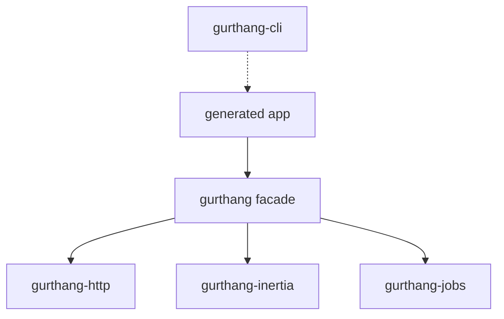
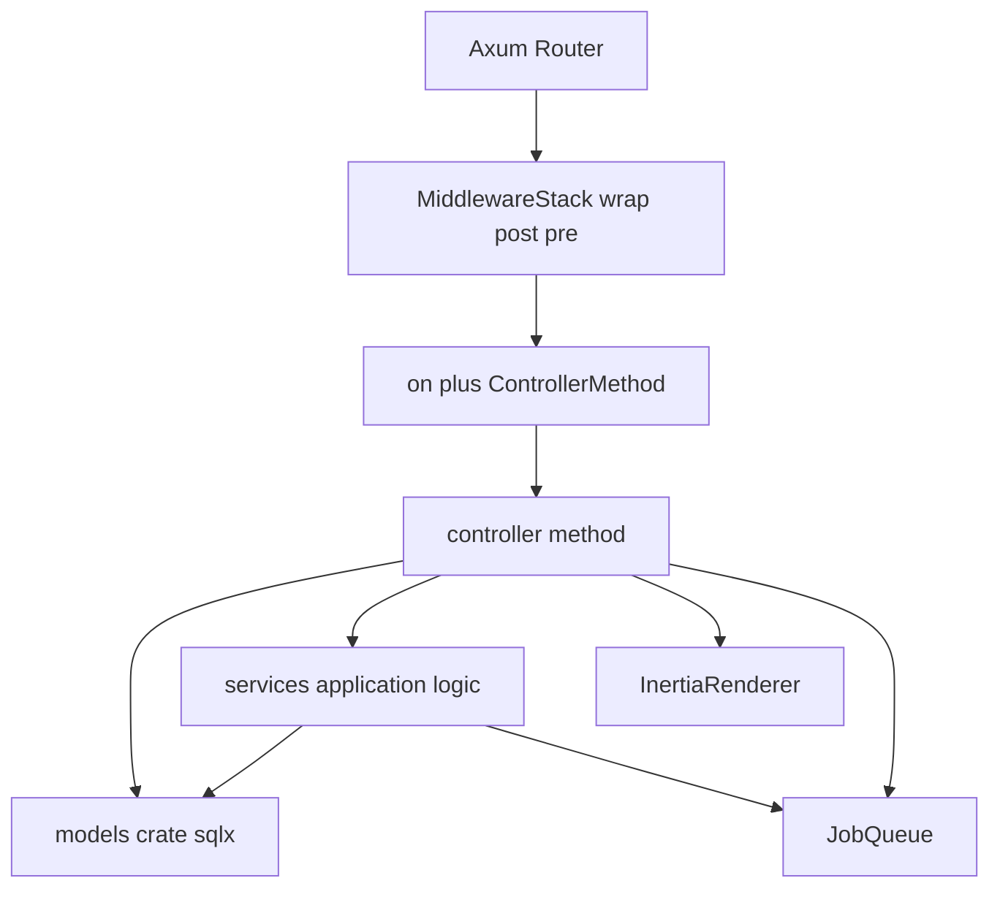
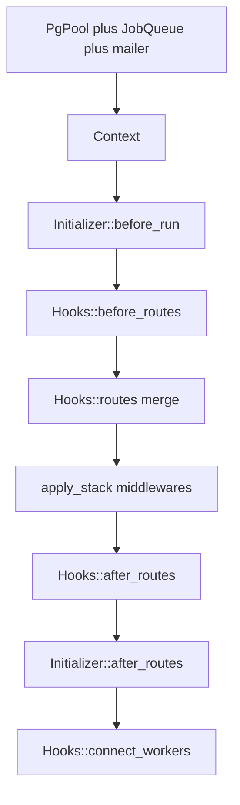

# ADR: Gurthang framework shape (T0)

Status: accepted
Feeds: T1 (middleware attach), T5 (registration), T8 (queue), T14 (Hooks lifecycle)

Gurthang is Laravel’s **workflow** on a compiler-checked, schema-first, agent-first
substrate — not Laravel-in-PHP directories, not Loco+SeaORM, not Rwf’s own
server/ORM/templates.

Non-negotiables: **sqlx**, **Inertia**, **Axum**, **agent-first CLI**, **MVC**,
**type-driven design** (Palmieri parse-don’t-validate).

T0 is a design lock. This ADR is the deliverable. Template and generator changes
land when later topics touch those files.

---

## Crate layers and call path

Apps depend on **one** crate: `gurthang`. That crate is a composition facade.
The work happens in primitive crates underneath it. Do not flatten those
primitives into `gurthang` as a monolith, and do not make generated apps
depend on the leaf crates directly.



**Request call path**



| Crate | Role | Primitives (build on these) |
| --- | --- | --- |
| `gurthang-http` | HTTP plumbing | `Route`, `mount!`, `on` / `ControllerMethod`, CSRF `protect`, `PostgresSessionStore`, `AssetResolver` |
| `gurthang-inertia` | UI protocol | `InertiaRenderer`, `InertiaRequest`, `InertiaPage` / `Page`, `mutation_redirect` |
| `gurthang-jobs` | background work | `JobQueue`, `JobWorker`, `PerformJob`, `enqueue` / `enqueue_in` |
| `gurthang` | composition | `Context`, `Hooks`, `create_app`, `MiddlewareLayer` / `MiddlewareStack` / kinds, `Task`, `Mailer`, config |
| CLI crates | not on the request path | `new`, `generate`, `sync`, `db`, `run`, `build`, `tools` |

**Rule:** new capabilities start as primitives (a type + a small crate or
`gurthang` module) and get composed through `gurthang`. Later: `Validate` /
`TryFrom<Raw>` (T2), `Page<T>` (T12), `Cache` (T10), signed URL / AEAD helpers
(T13), `Event` / `Ability` (T5/T3). Same pattern as today: leaf primitive,
facade re-export, generator, `sync --check`.

---

## Current layers

Generated app (`gurthang new` / `crates/gurthang-new/templates`):

```text
my-app/
  models/                 # sqlx query! only — compile firewall
  src/app.rs              # impl Hooks for App
  src/controllers/        # mount! + handlers; may call models
  src/routes/             # Route { name, path } catalog
  src/services/           # application logic
  src/workers/ tasks/ mailers/ initializers/
  resources/js/           # Inertia + ts-rs + routes.ts
```

Boot order (`crates/gurthang/src/boot.rs` `create_app`):



`Hooks` today: `app_name`, `boot`, `routes`, `connect_workers`,
`register_tasks`, `middlewares`, `before_routes`, `after_routes`,
`on_shutdown`, `initializers`, `export_payloads`.

### Pros

- **Models crate** keeps sqlx macros off the controller rebuild path.
- **Named `routes/` + `mount!`** is greppable and syncs to TypeScript.
- **`Context` + Axum `FromRef`** is the right DI story. No service container.
- **Generators + `sync --check`** are the agent substrate.
- **Postgres job queue** (leases, backoff, LISTEN/NOTIFY,
  `enqueue_in(&mut PgConnection)`) stays first-class.
- **Loco-shaped directories** are paid for. Keep the folders; drop Loco
  YAML-as-control-plane.

### Cons (corrected)

- **Registration is scattered**, but the fix is **more explicit
  `register_*` functions** (Andurel/fx style), not fewer Hooks methods. See
  below.
- **Hooks mixes lifecycle with catalogs.** `export_payloads` is a build
  concern. `before_routes` / `after_routes` / `Initializer::after_routes`
  are three router-mutation points. `boot` is required but always
  `create_app::<Self>`.
- **Session auth is two-channel on master.** YAML lists `session_auth`
  (no-op `apply`); real layers live in `AuthInitializer::after_routes`.
  `feat/pavex-middleware` moves session/authn into `Hooks::middlewares` —
  keep that, and stop using YAML `enable:` as the on/off switch.
- **No typed input boundary.** Only hand-rolled `User::validate`.
- **`task` / `middleware` CLI** shell out to `cargo run` instead of static
  introspection.

There is **no `Controller` trait** and we are not adding one. `on()` plus a
cloneable struct plus inherent methods is the primitive. That was listed as
a “con” earlier; it is just the convention. Document it, do not trait-wrap
it.

---

## Steal / avoid / adapt

### Laravel — steal the roles, not the tree

- Provider **roles** become `register_*` functions (routes, auth, events,
  schedule), not auto-discovered providers or a DI container.
- Named middleware + groups attached to routes (T1), in **code** — Laravel’s
  `bootstrap/app.php` / middleware groups are PHP, not YAML.
- FormRequest as a typed parse boundary (T2): `Raw -> Validated`.
- Policies as a registration slot (T3).
- Avoid: Eloquent, facades, Blade, runtime route cache, multi-driver
  cache/storage as core.

### Loco — keep the folders, drop YAML-as-control-plane

- Keep directory names and `Hooks` as the app’s single type.
- Keep schema-first generation.
- Steal later: framework health routes (T15); `boot_test` harness (T17).
- **Do not steal** `config/scheduler.yaml` or middleware `enable:` flags.
- Avoid: SeaORM, Tera/`ViewRenderer`, multi-DB, extra Loco lifecycle hooks
  (`after_context`, seed/truncate on Hooks).

### Rwf — steal attach points and worker clock

- Per-controller / group middleware attach (T1), composed in Rust.
- Worker hosts jobs **and** the scheduler clock. One `StartMode::Worker`.
- `Page<T>` + `?page`/`?page_size` as a framework type (T12). No `crud!`.
- Crypto primitives for cookies/signed URLs (T13). Keep **Postgres
  sessions** (opaque id). See “Why not encrypted-cookie sessions.”
- Admin/observability panel is the T15 target.
- Avoid: own ORM, own HTTP server, Turbo/templates, runtime-checked queries.
- **Out of architecture for v1:** WebSockets / server push.

### Andurel — steal fx-shaped wiring, not a Rust DI container

Andurel registers with Uber Fx: `fx.Provide` constructors, `fx.Invoke` to
call `RegisterRoutes` / `worker.Register`, modules per concern, generators
patch the module. Gurthang should feel the same **without** adopting a
container:

- Each subsystem gets a **`register_*` Hooks method** the generator can
  patch in `src/app.rs` (`register_routes`, `register_workers`,
  `register_tasks`, later `register_schedule`, `register_events`,
  `register_policies`).
- Constructors stay ordinary Rust (`Auth { inertia }`, worker structs).
- `Context` + `FromRef` remains the only injection. No fx-in-Rust.

**Do other Rust frameworks use a DI / service container?** Almost none
in the Laravel/fx sense (resolve a graph, manage lifecycles, auto-wire
constructors):

- **Axum, Actix, Rocket, Rwf:** no container. App state / extractors.
  Gurthang already matches Axum (`State<Context>` + `FromRef`).
- **Loco:** same `AppContext` + `FromRef` shape as us. Optional
  `SharedStore` is a `TypeId` hashmap you insert into — Loco’s own docs
  say it does not resolve a graph or manage lifecycles. Not a container.
- **Pavex:** the real exception. Compile-time constructor graph
  (`#[singleton]` / `#[request_scoped]` / `#[transient]`), registered on
  a Blueprint. That DI is Pavex’s compiler, not something you drop onto
  Axum. We already steal Pavex’s *middleware kinds*; we do not take the
  injector.
- **spring-rs:** Spring-inspired plugins + a `Component` extractor. A
  plugin registry, not Laravel’s container.

So “no service container” is the Rust-web default, not a Gurthang
quirk. Stay on `Context` + `FromRef`. If an app needs an extra client,
put it on `Context` (or a later typed slot), not a hidden bag.

---

## Generated-app layout

**Keep the current tree.** Do not rename `workers/` → `jobs/`. Do not add
`providers/` or `app/Http/Controllers`.

Reserve folders when topics land (template grows then):

```text
src/
  app.rs                 # impl Hooks for App — register_* live here 
  controllers/
  routes/                # named catalog remains SSOT
  services/              # application logic
  http/
    requests/            # T2 validated input types
    middleware/          # app-specific layers only
  policies/              # T3
  events/ listeners/ observers/ notifications/   # T5
  workers/ mailers/ tasks/ initializers/
config/
  {development,test,production}.yaml   # values, not on/off switches
models/                  # sqlx only; optional column newtypes (T2)
```

No `config/scheduler.yaml`. Schedule is registered in Rust (see below).

### MVC rule

- **Model:** owns SQL (`query!` / `query_as!`) and domain invariants. No
  HTTP, no Inertia.
- **Controller:** HTTP. Extract, parse, render/redirect. **May hold
  `PgPool` and call model functions.** That is not “owning SQL.” Owning
  SQL would be embedding `query!` in the controller.
- **Service:** **application logic** — workflows that are more than one
  model call plus a render (auth register/login, multi-model writes +
  enqueue, transactions). Do not add pass-through services around a
  single `Model::find`.
- **Request (T2):** parse raw form/JSON into a validated type.
- **Worker / mailer / task:** side effects, listed from a `register_*` fn.

Scaffolds that put `PgPool` on the controller and call `Model::list` /
`find` are **correct**. Auth going through `services::auth` is also
correct, because registration/login is application logic. Those are two
legitimate shapes, not a bug.

---

## App-definition API

**More `register_*` Hooks methods, all defined in `src/app.rs`.**
Andurel’s fx modules, not a free-function layer and not more Loco
lifecycle hooks.

Two different “routes” functions already exist. Keep both; do not add a
third:

| What | Where it is defined | Who patches it |
| --- | --- | --- |
| Per-controller router | `src/controllers/<name>.rs` — `pub fn routes(ctx) -> Router<Context>` with `mount!` | `gurthang generate controller` creates the file |
| App catalog (which controllers are mounted) | `src/app.rs` — `impl Hooks for App` method `register_routes` (today this is `Hooks::routes`) | `gurthang-generate` `wiring.rs` inserts `.add_route(controllers::x::routes(ctx))` |

There is no crate-level free `fn register_routes` that Hooks delegates
to. The earlier sketch showed both and that was the confusion. The
Hooks method *is* the definition. Same for workers/tasks/schedule:
the trait method in `src/app.rs` is the list the generator patches.

```rust
// src/app.rs — this is the definition. Generators patch this impl.
impl Hooks for App {
    fn app_name() -> &'static str { env!("CARGO_PKG_NAME") }
    // boot defaulted to create_app::<Self>

    fn register_routes(routes: &mut AppRoutes, ctx: &Context) {
        routes
            .add(controllers::welcome::routes(ctx))
            .add(controllers::auth::routes(ctx))
            .add(controllers::dashboard::routes(ctx));
        // generate controller appends the next .add(...) here
    }

    fn register_workers(workers: &mut WorkerRegistry) {
        workers.add::<workers::PurgeExpiredSessions>();
    }

    fn register_tasks(tasks: &mut Tasks) { /* generate task patches here */ }

    // later, same place, same shape:
    // fn register_schedule(schedule: &mut Schedule) { ... }
    // fn register_events(events: &mut EventBus) { ... }
    // fn register_policies(policies: &mut PolicyRegistry) { ... }

    fn middlewares(ctx: &Context) -> MiddlewareStack {
        default_middleware_stack(ctx)
            .replace("session_auth", SessionAuthLayer::from_ctx(ctx))
    }

    fn initializers(ctx: &Context) -> Vec<Box<dyn Initializer>> {
        vec![Box::new(ViewEngineInitializer)] // Context mutation only
    }
}
```

`create_app` calls `H::register_routes` (rename of today’s `H::routes`)
when building the router. Controllers never register themselves.

**Stays on Hooks:** `app_name`, defaulted `boot`, the `register_*` family,
`middlewares` (Rust stack), `initializers`, `on_shutdown`.

**Leaves Hooks:**

- `export_payloads` → `gurthang sync payloads` / the export bin.
- Collapse `before_routes` / `Hooks::after_routes` /
  `Initializer::after_routes` to **one** post-merge router hook (asset
  mount).
- Empty `workers::x::register` stubs: listing the type in
  `register_workers` is enough.

**DI stays** `Context` + `FromRef`. No container.

T5 implements more `register_*` slots. It does not invent a second
registration story.

---

## Scheduler: code, not YAML

How the three sources do it:

- **Laravel:** code. `$schedule->command(...)->hourly()` in
  `routes/console.php` / the console kernel. `schedule:run` executes it.
  Not YAML.
- **Rwf:** code. `schedule(cron)` on the job plus `Worker::clock` in the
  worker process. Not YAML.
- **Loco:** `config/scheduler.yaml` (English phrases + cron). Config-as-
  schedule.

Gurthang follows **Laravel + Rwf + Andurel**: `register_schedule` in Rust,
executed by the worker clock (Rwf). A `gurthang schedule` / `--list`
command for agents. Do not add `scheduler.yaml`.

---

## Middleware: Pavex kinds in Rust, not YAML on/off

`feat/pavex-middleware` (PR #2) is the right **kind and composition**
model. It is the wrong **control plane** if membership stays in YAML
`enable: true/false` (that is Loco). Rails and Laravel attach and toggle
middleware in code.

Lock from the PR:

- `MiddlewareKind` = `Wrap` | `Post` | `Pre`
- Pipeline: `wrap → post → pre → handler`
- `MiddlewareStack` with name-based `replace` / `insert_*` / `validate`
- Placeholder + `replace` for typed `SessionAuthLayer<B>` and `RequireAuth<B>`
- `Authorizer` + `RequireAuthz` (T3); `MetricsRecorder` (T15)

Change relative to the PR and to master:

- **Default stack is constructed in Rust.** `Hooks::middlewares` is the
  source of truth for what runs.
- YAML does **not** influence middleware (not membership, not values).
  Timeouts, rate limits, public paths, and similar live in Rust defaults
  or in `Hooks::middlewares` / `RouteGroup::add_mw` arguments. Leftover
  `server.middlewares` in old YAML is ignored.
- Group attach is `RouteGroup::add_mw(layer)` on a sub-router once, then
  merge. Global stack applied once after merge.
  `gurthang middleware --routes` prints names + kinds + scope.

---

## Why not encrypted-cookie sessions

Rwf (and Laravel’s `cookie` session driver) store the session **body** in
an encrypted cookie. Gurthang stores the body in Postgres and puts an
**opaque id** on the cookie (`tower-sessions` + `sessions` table). Keep
that.

Encrypted-cookie sessions are a poor default here:

1. **Size.** Cookies are ~4KB. Flash, `errors`, `old.*`, and growing
   shared props do not fit. You start chunking or silently dropping.
2. **Revocation.** Logout-all, password change, and “this session is
   dead” are a row delete. A cookie blob lives until expiry unless you
   add a server-side denylist — at which point you have a session store
   again.
3. **Workers already share Postgres.** Cookie sessions buy you “no
   store.” We already have a store and `LISTEN`/`NOTIFY`. No win.
4. **Theft window.** A stolen AEAD cookie *is* the session until TTL.
   A stolen id can be deleted immediately.

What T13 still does: encrypt/sign the **opaque** cookie (defense in
depth) and HMAC signed URLs (verify/reset/download) with expiry. That is
not moving the session body into the cookie.

---

## First-class vs later

**First-class** (primitives + `register_*` + CLI + generators; implement
on the roadmap):

- Named routes + `AppRoutes` + `sync routes`
- Middleware kinds + Rust stack + group/route scope + `middleware --routes`
- Models crate + sqlx offline + `sync model --check`
- Validated request types (`generate request`) (T2)
- Job queue + `JobBackend` + transactional enqueue (T8)
- Worker clock + `register_schedule` (T5)
- Event/listener/observer/notification/policy slots as more `register_*`
- Inertia renderer + ts-rs payloads (export off Hooks)
- `Page<T>` / paginate (T12)
- Postgres `Cache` (T10)
- App key / encrypt / signed URLs (T13)
- Health + structured logs/metrics + `gurthang jobs` (T15)
- `--json`, `gurthang check`, `gurthang manifest` (T18)
- Test boot + fakes (T17)
- House rule: every capability ships `generate`, `--dry-run`, and
  `sync --check` where regeneration applies

**App-level or parked:** mail copy, auth backend impl, WebSockets, file
storage (T11), search (T16), OAuth/MFA (T3 later), multi-queue Redis,
OpenDAL, reversible migrations as later tooling.

---

## Per-topic recommendations

- **T1:** Keep Pavex kinds from PR #2. Move membership off YAML `enable`
  into `Hooks::middlewares`. Attach by wrapping sub-routers. `--routes`.
  Measure compile times.
- **T2:** `http/requests` + `TryFrom<Raw>` / `Validate`. Models may own
  column newtypes. Inertia `errors` + `old.*` on failure.
- **T5:** Add `register_events` / `register_schedule` / etc. Scheduler is
  Rust + worker clock (Laravel/Rwf), not Loco YAML.
- **T8:** Stay app-owned Postgres queue; extract `JobBackend`. Preserve
  `enqueue_in(&mut PgConnection)`. `gurthang jobs` inspector.
- **T14:** Document boot order. Collapse extra router hooks. Move
  `export_payloads` off Hooks. Keep the `register_*` family.
