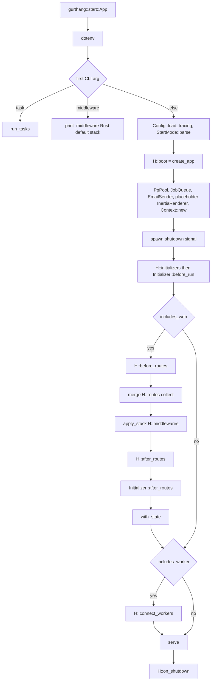
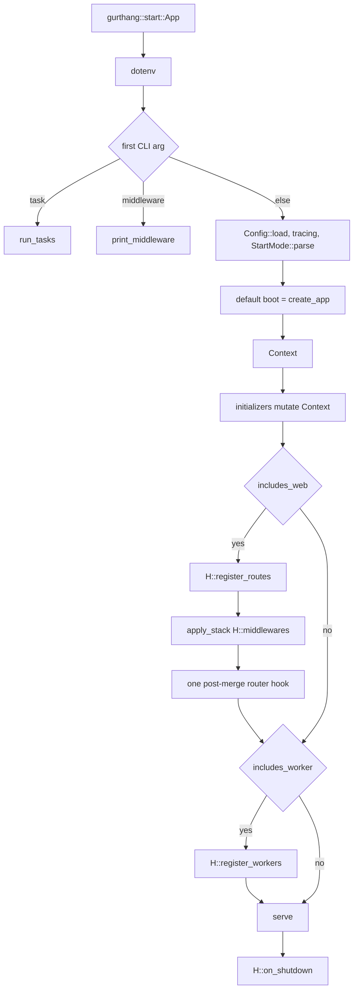

# Boot order

T0 is a design lock. This document records **current** boot order and the
**accepted target** in [framework-shape](adr/framework-shape.md). The code stays
as-is until **T14** applies that target.

## Entry

Generated `src/main.rs` calls `gurthang::start::<App>()`.

`gurthang task` and `gurthang middleware` still `cargo run` the app binary
(`cargo run --bin <app> -- task|middleware`). Those args are handled inside
`start`, not by a separate introspection binary.

## `start` (`crates/gurthang/src/boot.rs`)

1. `dotenvy::dotenv()`
2. First CLI argument:
   - `task` → `run_tasks` (`H::register_tasks`; `--list` prints names; a named
     task loads config, initializes tracing, then `create_app::<H>(StartMode::Web)`)
   - `middleware` → `print_middleware` (Rust default stack; `--routes` adds a
     `scope` column. **no `Hooks`**; does not boot Postgres)
   - otherwise → `Config::load`, tracing, `StartMode::parse` (that arg, or
     `All` if absent), `H::boot`, `serve`, `H::on_shutdown`

Template `App::boot` always calls `create_app::<Self>`.

## `create_app`

1. `PgPool`, `JobQueue`, `EmailSender`, placeholder `InertiaRenderer`
   (`InertiaRenderer::new("", H::app_name(), "")`), `Context::new`
2. Spawn the shutdown signal (`ctrl_c` / `SIGTERM` → watch channel)
3. `H::initializers`, then each `Initializer::before_run`
   (template: `ViewEngineInitializer` replaces `ctx.inertia`)
4. If `mode.includes_web()`:
   - `H::before_routes`
   - merge `H::routes().collect()`
   - `apply_stack(H::middlewares)`
   - `H::after_routes` (template: `assets::mount`)
   - each `Initializer::after_routes` (template: view engine does not override)
   - `with_state`
5. If `mode.includes_worker()`: `H::connect_workers`
   (template: skip the worker loop on `Web`; otherwise `JobWorker::run` for
   `Worker`, `tokio::spawn` for `All`)

`serve` binds and runs Axum for `All` and `Web`. It no-ops for `Worker`.

## `StartMode`

| Mode | `includes_web` | `includes_worker` |
| --- | --- | --- |
| `All` (default; CLI `all` or omitted) | yes | yes |
| `Web` | yes | no |
| `Worker` | no | yes |

## `Hooks` today (`crates/gurthang/src/app.rs`)

`app_name`, `boot`, `routes`, `connect_workers`, `register_tasks`,
`middlewares`, `before_routes`, `after_routes`, `on_shutdown`, `initializers`,
`export_payloads`.

`Initializer`: `name`, `before_run`, `after_routes`.

## Current

## Target (T14 applies this)

Locked in the [ADR](adr/framework-shape.md). Not implemented yet.

- Default `boot` = `create_app` (apps stop writing a passthrough)
- `register_routes` replaces `routes`
- `register_workers` replaces `connect_workers` and per-worker `register` stubs
- Collapse `before_routes`, `Hooks::after_routes`, and `Initializer::after_routes`
  to **one** post-merge router hook
- `initializers` mutate `Context` only
- Session/auth live in `Hooks::middlewares` (Pavex kinds; YAML does not
  influence middleware)
- `export_payloads` leaves `Hooks` (`gurthang sync payloads` / the export bin)
- More `register_*` methods on `impl Hooks for App` in `src/app.rs`
  (`register_tasks` already; later schedule, events, policies)

Stays on `Hooks`: `app_name`, defaulted `boot`, the `register_*` family,
`middlewares`, `initializers`, `on_shutdown`.

