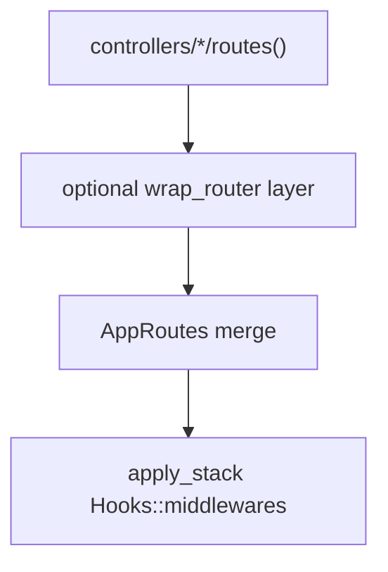

# Finish T1 on `feat/pavex-middleware`

T0 is locked except where this review overrides the control plane: **YAML
does not influence middleware.** Membership and values live in Rust.

This PR already has Pavex kinds, batteries, and `Hooks::middlewares`
`replace` for session/auth. Remaining work is the attach API and cutting
YAML out of the stack.

**Do not rewrite the template auth story.** Group wrap is opt-in; apps
call it when they want it.

## Decision (review)

Group attach lives in `crates/gurthang/src/controller/middleware/mod.rs`.
Apps may call it from `controllers/*/routes()`. The generated app keeps
global `session_auth` + `authn` `replace` in
`crates/gurthang-new/templates/src/app.rs`.

Out of this PR:

- dashboard wrap / second auth path
- `generate controller` RequireAuth scaffold
- T5 `register_*`, T8 `JobBackend`, T14 hook collapse

Roadmap T1 acceptance currently asks for a generated controller group wrap
and a template end-to-end group middleware. This plan **narrows that**:
ship the API + tests + docs; update T1 acceptance in `docs/roadmap.md` to
match.

## Attach API: wrapper function, not a stack in `routes()`

Do **not** make apps build a `MiddlewareStack` just to wrap a controller
router. `MiddlewareStack` stays the global `Hooks::middlewares` type
(`push` / `replace` / `delete`). Group attach is a wrapper:

```rust
/// Apply one layer to a sub-router (same wrap → post → pre composition).
pub fn wrap_router(
    router: Router<Context>,
    layer: impl MiddlewareLayer + 'static,
) -> Result<Router<Context>> {
    apply_stack(router, MiddlewareStack::new().with(Box::new(layer)))
}
```

Chain for more than one layer. Leave `mount!` unchanged. Export
`wrap_router` from the prelude.

Docs / tests only (not wired into the template):

```rust
pub fn routes(ctx: &Context) -> Router<Context> {
    wrap_router(
        mount!(admin, { /* … */ }),
        authn::RequireAuth::<AuthBackend>::new(/* rust values */),
    )
    .expect("group middleware")
}
```



## YAML does not influence middleware

Delete the `server.middlewares` block from template YAML
(`development.yaml`, `test.yaml`, `production.yaml`). Do not read
timeouts, rate limits, public_paths, or `enable` from YAML.

- `default_middleware_stack` is **Rust-only** (environment defaults).
  Rename away from `stack_from_config`. `print_middleware` uses that
  stack, not YAML.
- Drop `enable` / `is_enabled()` as a membership switch. Presence in
  the stack means on. Leftover `server.middlewares` in old YAML is
  ignored.
- Default-off layers (`cors`, `compression`, `secure_headers`) are
  absent until an app `push`es them in `Hooks::middlewares`.
- Placeholders stay for `session_auth`, `authn`, `authz` (authz without
  an authorizer must not apply). Template `RequireAuth` values are
  constructed in `app.rs`, not loaded from config.
- Environment defaults in Rust: skip `fallback` in production; skip
  `rate_limit` in test; include `remote_ip`. CSRF cookie `secure` still
  follows `session.secure` (session config, not a middleware YAML
  block).
- Update the ADR middleware section: YAML is not the values plane
  either. Amend `docs/middleware.md` the same way.

## `gurthang middleware --routes`

Do not boot Postgres. Parse `--routes` in `start` and forward it from
the CLI.

- Default print: `kind` + `name` (no enabled/disabled column).
- `--routes`: `scope` column. This PR prints `global` for the Rust
  default stack. Tests cover the print shape for a `wrap_router` group.
  Wiring print to `H::middlewares` is a later follow-up (needs Context).
- CLI help: drop “YAML middleware stack with enable flags”.

## Docs (T0, not T14)

- `docs/middleware.md`: wrapper example; no YAML; `RequireAuthz` (not
  `RequireAuthorizer`); CLI prints the Rust default stack, runtime uses
  `Hooks::middlewares`.
- `docs/lifecycle.md`: delete the stale `AuthInitializer` line. Do not
  implement the T14 target.
- `docs/roadmap.md` T1: opt-in wrapper; no template auth relocate; no
  generator scaffold; YAML out of middleware.

## Tests and PR notes

- Integration: `wrap_router` a sub-router with a `pre` that returns 401;
  sibling merged route is unaffected; wrapped route is.
- Unit: default-off layers absent; test env omits `rate_limit`; `delete`
  removes a layer; `--routes` print includes `scope`.
- `cargo test --workspace`. Record `cargo build --timings` on the
  template app in the PR. No `mount!` per-route wrappers.
